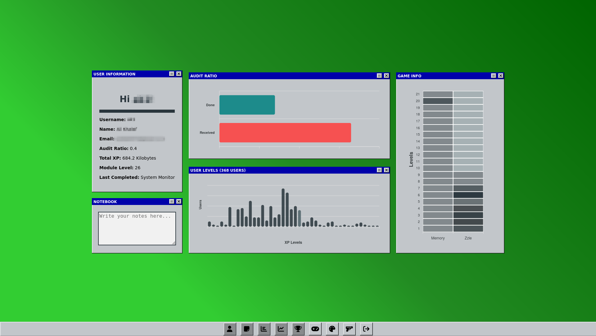

# 01-displayer

01-displayer is a GraphQL based project made using Next.js. It receives certain information within the reboot Bahrain intra website and allows other information displayed within the database made for it. 

## Components Overview

### 1. **User Information**
- **Description**: Displays detailed information about the current user.
- **Details Shown**:
  - **Username**: User's login name.
  - **Name**: User's full name, formatted with capitalization.
  - **Email**: User's email address.
  - **Audit Ratio**: A metric indicating the user's audit performance.
  - **Total XP**: The user's experience points, displayed in kilobytes.
  - **Module Level**: The user's current module progress level.
  - **Last Completed**: The name of the last completed project.

### 2. **Audit Ratio**
- **Description**: A bar chart visualizing the user's audit ratio.
- **Details Shown**:
  - Interactive chart that represents the ratio visually.
  - Buttons to toggle fullscreen and visibility.

### 3. **Total Users**
- **Description**: A chart showing XP distribution across all users.
- **Details Shown**:
  - The levels and experience distribution among the total user base.
  - Interactive controls for fullscreen and visibility.

### 4. **Game Information**
- **Description**: A placeholder for displaying information about a logic-based game.
- **Details Shown**:
  - Title: "GAME INFO."
  - Placeholder for integrating additional game-specific data.

### 5. **Notebook**
- **Description**: A simple text editor for user notes.
- **Details Shown**:
  - Editable text area for writing and saving notes.
  - Title: "NOTEBOOK."
  - Buttons for fullscreen and visibility.

### 6. **Colors**
- **Description**: A color picker component.
- **Details Shown**:
  - A grid of color options to choose from.
  - Allows saving and applying a selected color.

### 7. **Minesweeper**
- **Description**: A classic Minesweeper game.
- **Details Shown**:
  - Title: "MINESWEEPER."
  - Interactive gameplay.
  - Buttons for fullscreen and visibility.

### 8. **Space Invaders**
- **Description**: A classic Space Invaders game.
- **Details Shown**:
  - Title: "SPACE INVADERS."
  - Interactive gameplay.
  - Buttons for fullscreen and visibility.

## Navigation
- A **window bar** allows users to toggle the visibility of each component.
- **Icons** in the bar:
  - User Information: 
  - Notebook: 
  - Audit Ratio: 
  - XP Distribution: 
  - Game Info: 
  - Minesweeper: 
  - Colors: 
  - Space Invaders: 

## Interactivity
- Most components feature fullscreen toggles and visibility controls via intuitive button icons.
- **Logout Button**: Allows the user to exit the application.
